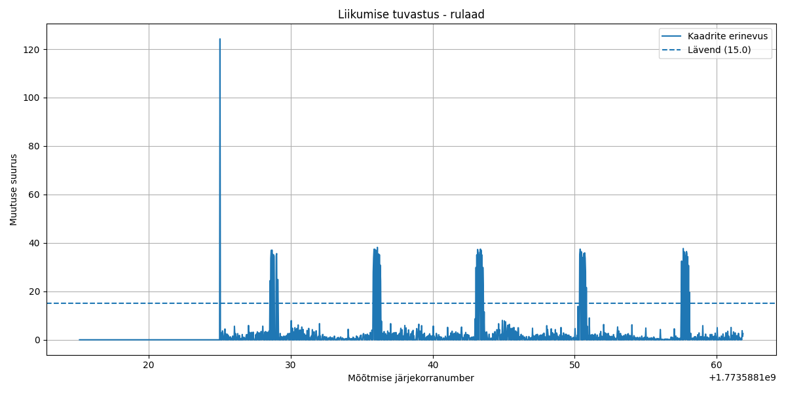

### Q1
Tõusud on väga selgesti eristatavad. kaadrivahe on umbes 37-38 nendel hetkedel maksimaalselt.
### Q2
Motion_threshold = 15 on korralik, kui kaadris ei toimu midagi muud peale selle, mis peaks toimuma. Tegelikult võiks see olla minimaalselt 30 ja maksimaalselt 35.
### Q3
See ühtib teoorias taktide arvuga. Tuvastati ka algne muutus rohelise pealt tavalise vaate peale, seega esimene takt ei ole mitte nullis, vaid esimene vist ikkagi?
### Q4
1 kaadri võrdluse jaoks läks 0.00012 sekundit. FPS ei peaks olema probleem.